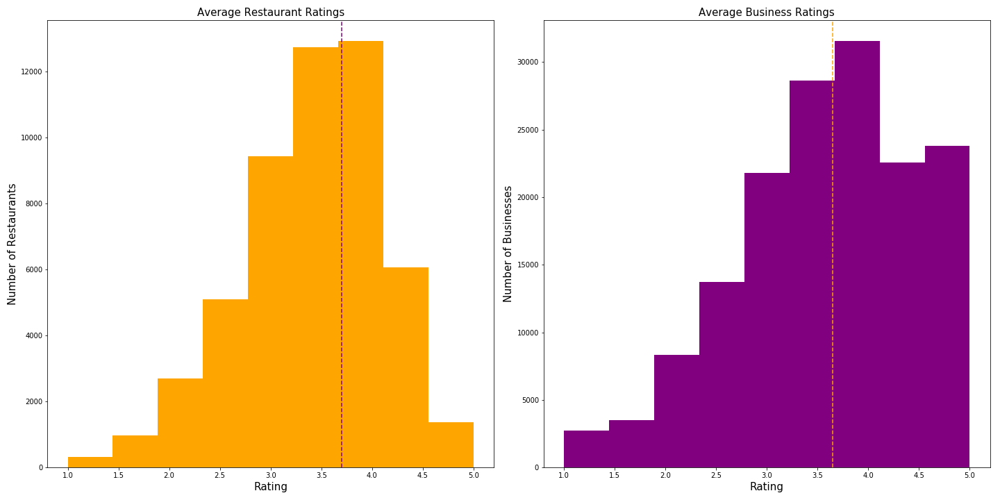

# Content Analysis and Classification of Yelp Reviews using Machine Learning

* [Motivation](https://github.com/maxgrossenbacher/nlp_yelp_reviews#motivation)
* [Overview](https://github.com/maxgrossenbacher/nlp_yelp_reviews#overview)
* [The Data](https://github.com/maxgrossenbacher/nlp_yelp_reviews#the-data)
* [EDA & NLP Pipeline](https://github.com/maxgrossenbacher/nlp_yelp_reviews#part-1)
* [Latent Topic Analysis](https://github.com/maxgrossenbacher/nlp_yelp_reviews#part-2)
* [Review Classification](https://github.com/maxgrossenbacher/nlp_yelp_reviews#part-3)
* [Web App](https://github.com/maxgrossenbacher/nlp_yelp_reviews#web-app)
* [Conclusions](https://github.com/maxgrossenbacher/nlp_yelp_reviews#conclusion)
* [Future Directions](https://github.com/maxgrossenbacher/nlp_yelp_reviews#future-directions)
* [Capstone Poster](https://github.com/maxgrossenbacher/nlp_yelp_reviews/blob/master/max_grossenbacher_poster_final.pdf)

## Motivation

*Why is Natural Langauage Processing Important?*  
Approximately "80% of business-relevant information originates in unstructured form, primarily text" ([breakthroughanalysis.com](https://breakthroughanalysis.com/2008/08/01/unstructured-data-and-the-80-percent-rule/)). Obviously, if some company wants to utilize all this information, then they must be able to take this unstructured free text and turn it into something meaningful and actionable. Natural language processing (NLP) attempts to do exactly this!  

Social media is a burgeoning field built on the premise of human-to-human interaction (mainly through free text) on the internet. In this field, the ability to wrangle unstructured data can provide key insights about specific users or businesses. These insights can be used to optimize marketing campaigns to target to specific users interests, build recommender systems or improve overall user experience.

## The Data:

[Yelp's Challenge Dataset](https://www.yelp.com/dataset/challenge) provides access to millions of user reviews. I was able to isolate over ~3 M reviews of over 51,000 businesses containing the category keyword restaurant.

#### Target Engineering
- **usefulness**: distinguish between useful and very-useful was somewhat arbitrary. I was trying to find ranges that would create more balanced classes.

|not_useful|useful|very_useful|
|:----------:|:------:|:--------:|
| useful = 0 |  0 < useful < 5 | useful >= 5|

- **sentiment**: grouping star rankings into more broad classes

|negative|neutral|positive|
|:----------:|:------:|:--------:|
| starsrev < 3 |  starsrev = 3 | starsrev > 3|

- **RestaurantsPriceRange2**: price rating of a restaurant (1-4) commonly seen as ($, $$, $$$, $$$$)

## Overview
This project is built around 3 main questions and explores the power of natural language processing to process and analyze text.
#### Objective 1:
Build a scaleable and reusable natural language processing pipeline
#### Objective 2:
Find latent topics/keywords for business on Yelp based solely on user reviews of that business
#### Objective 3:
Use machine learning to predict rating, usefulness and sentiment of a review

## Part 1:
### EDA:
This is a distribution of the average rating of all business compared to the average rating of restaurants in the Yelp business dataset. As you can see, restaurants are rated on average only slightly higher than the global business average rating.
  
You can see a majority of reviews are rated 4 and 5 stars. The average restaurant rating is ~3.7.
### Building NLP Pipeline:
[Yelp reviews were processed](https://github.com/maxgrossenbacher/nlp_yelp_reviews/blob/master/latent_topic_analysis.py) using the library Textacy. Textacy allows for mutli-threading of documents using SpaCy. During text processing, stop words are removed, words are tokenized and lemmatized, and a vocabulary of terms is generated.

## Part 2:
### Latent Topic Analysis of Reviews:
Once NLP data has been processed, NlpTopicAnalysis allows latent topic modeling using NMF, LDA (Latent Dirichlet Allocation) or LSA. For my purposes, I chose to model the yelp reviews using LDA. When modeling using LDA, best results are achieved using the term-frequency (TF) matrix of a corpus of documents. Below is a example termite plot of latent topics.  
  

* The bigger the circle, the more important the term is to the topic. The colored topics illustrate the 5 most important topics  
Additionally, NlpTopicAnalysis can create a interactive [pyLDAvis plot](images/pyLDAvis_most_reviewed.html) of these latent topics.  
  

We can see that topic 6* infers that this restaurant has a view of Bellagio Fountain in Las Vegas, Nevada. This is an example of how latent topic modeling can be used to provide insight into a business that would not normally be displayed in a business description or be used as a keyword to identify a business. Additionally, LDA can also provide insight into which topics are most important to reviewers. For this particular restaurant, topic 4** (the topic containing the terms steak, french and delicious) is the most important topic. Furthermore, using the pyLDAvis tool, we can visualize the relationship between different topics. Circles that overlap i.e. topic 5 and 6 contain similar or overlapping terms. Whereas topics spread further apart i.e. topic 1 and 2 contain terms that are not so similar to each other.   
Lastly, document embeddings were visualized using Tensorboard to create interactive 3-dimensional PCA and tSNE plots. The document vectors were created using SpaCy's preloaded [GloVe](https://nlp.stanford.edu/projects/glove/) vectors. The code corresponding to the document vectors of the restaurant above can be found [here](https://github.com/maxgrossenbacher/nlp_yelp_reviews/blob/master/word_embeddings.py).  

 * This corresponds to topic 5 in the termite plot above.  
 ** This corresponds to topic 3 in the termite plot above.

## Part 3:
### Classifying Reviews Using Machine learning:
#### Baseline:
[Multinomal Naive Bayes](http://scikit-learn.org/stable/modules/generated/sklearn.naive_bayes.MultinomialNB.html#sklearn.naive_bayes.MultinomialNB) is the standard Baseline model for Bag-of-words classification of text. Models were trained on 10,000 TF-IDF vectors with 4-fold cross validation. [Weighted F1 Score](http://scikit-learn.org/stable/modules/generated/sklearn.metrics.f1_score.html) was used to account for possible imbalance in classes. These models will be used as a baseline to which future models will be compared.  

| Target/Label | Parameters | Mean Train Score | Mean Test Score |
|:------------:|:----------:|:----------------:|:---------------:|
| usefulness | alpha = 1 | 0.445 | 0.445 |
| sentiment | alpha = 1 | 0.547 | 0.542 |
| rating | alpha = 1 | 0.354 | 0.342 |
| price | alpha = 1 | 0.592 | 0.586 |
| target* | alpha = 1 | 0.211 | 0.196 |  

* Target is a combination of rating and price range

#### Grid Search:
A [grid search](https://github.com/maxgrossenbacher/nlp_yelp_reviews/blob/master/grid_search.py) for each target/label was run on 3 different classification models:  
* [Gradient Boosted Classifier](http://scikit-learn.org/stable/modules/generated/sklearn.ensemble.GradientBoostingClassifier.html)
* [Random Forest Classifier](http://scikit-learn.org/stable/modules/generated/sklearn.ensemble.RandomForestClassifier.html)
* [Support Vector Machine -- SVC](http://scikit-learn.org/stable/modules/generated/sklearn.svm.SVC.html#sklearn.svm.SVC)

#### Grid Search Best Models & Parameters:
Models were trained on 10,000 TF-IDF vectors generated from random user reviews with a 4-Fold cross validation. Once again, the weighted F1 score was used to account for possible imbalance in class.  

#### TF-IDF Vectors
| Target/Label | Model | Parameters | Mean Train Score | Mean Test Score |  
|:------------:|:-----:|:----------:|:----------------:|:---------------:|
| usefulness | Random Forest | max_features: sqrt; n_estimators: 1000 | 0.991 | 0.579 |  
| sentiment | Gradient Boosted Trees | learning_rate: 0.1; max_features: sqrt; n_estimators: 500 | 0.823 | 0.676 |  
| rating | Gradient Boosted Trees | learning_rate: 0.1; max_features: sqrt; n_estimators: 500 | 0.773 | 0.439 |  
| price | Random Forest | max_features: sqrt; n_estimators: 500 | 0.987 | 0.651 |  
| target | SVC | C: 10; kernel: linear; shrinking: True | 0.329 | 0.283 |  

   * Full Grid Search CVs can be found in [grid_cvs](https://github.com/maxgrossenbacher/nlp_yelp_reviews/tree/master/grid_cvs)   

#### Doc2vec Vectors
| Target/Label | Model | Parameters | Mean Train Score | Mean Test Score |  
|:------------:|:-----:|:----------:|:----------------:|:---------------:|
| usefulness | Random Forest | max_features: sqrt; n_estimators: 1000 | 1.0 | 0.582 |  
| sentiment | Gradient Boosted Trees | learning_rate: 0.1; max_features: sqrt; n_estimators: 500 | 0.974 | 0.727 |  
| rating | Gradient Boosted Trees | learning_rate: 0.1; max_features: sqrt; n_estimators: 500 | 0.976 | 0.500 |  
| price | Random Forest | max_features: sqrt; n_estimators: 500 | 1.0 | 0.598 |  
| target | SVC | C: 10; kernel: linear; shrinking: True | 0.253 | 0.222 |  

Each model demonstrates overfitting on the training data. Free text can often be very messy. Humans have many different ways to express the same idea, feeling or concept. This may be one reason why these models tend to overfit on the training data.

#### Final Models:
Balancing classes: based on [EDA](https://github.com/maxgrossenbacher/nlp_yelp_reviews#eda) of the yelp reviews dataset, it is clear that some classes are imbalanced. For instance, there are more reviews rated 4 and 5 than there are reviews rated 3, 2 or 1. In order to account for this imbalance. Previously, I used a weighted f1 score to account for this class imbalance. However for the final models, I randomly sampled from the dataset making sure that there was an equal distribution of reviews in each class. Final models were train on 300,000 reviews (to avoid overfitting) represented as doc2vec vectors using GloVe. These models are employed in The Yelp Review Scorer to predict usefulness, sentiment and rating of a review.

| Target/Label | Model | Parameters | Accuracy | F1 score |  
|:------------:|:-----:|:----------:|:--------:|:--------:|
| usefulness | Random Forest | max_features: sqrt; n_estimators: 1000 | 62.5% | 0.625 |  
| sentiment | Gradient Boosted Trees | learning_rate: 0.1; max_features: sqrt; n_estimators: 500 | 68.0% | 0.680 |  
| rating | Gradient Boosted Trees | learning_rate: 0.1; max_features: sqrt; n_estimators: 500 | 50.7% | 0.504 |  

#### Seq2Seq:
[Seq2seq](https://github.com/maxgrossenbacher/nlp_yelp_reviews/blob/master/seq2seq_script.sh) models were attempted to predict more complex labels including the "target" label, which is a combination of rating of a review and price of a restaurant. More time was needed in order to optimize these models. Neural networks may provide a future direction for this project in order to control overfitting.

## Web App:
[The Yelp Review Scorer](https://github.com/maxgrossenbacher/nlp_yelp_reviews/tree/master/web_app) will process a Yelp-type review and output a usefulness score, sentiment score, and suggested rating. Scores are predicted using the final models and parameters obtained [above](https://github.com/maxgrossenbacher/nlp_yelp_reviews#doc2vec-models). Have fun!

## Conclusion:

Using the optimized models, we see a 28%, 25% and 30% increase in weighted F1 score for predicting rating, sentiment and usefulness of a review. Additionally, we can see that using doc2vec representations of reviews, instead of TF-IDF (bag-of-words) vectors, increases the predictive performance of each model by 46%, 34% and 31% respectively as compared to the Naive Bayes Baseline model.
Using The Yelp Review Scorer, users may score their model for probability of usefulness as well as overall sentiment and suggested rating. Hopefully, over time, more useful reviews will improve the user experience by providing users with more helpful and relevant reviews.

## Future Directions:
Trying different classification techniques, for example a multinomial neural network may improve F1 scores.  
Additionally, targets can be modified to better capture the essence of what we are trying to predict. Usefulness was based solely on the number of useful votes a review received at the time Yelp complied the challenge dataset. It would be helpful to collect data on the date a review was posted or the number of views a review received. By applying a time or number of views penalty, one may be able to improve upon these usefulness scores.  
Lastly, expanding sentiment analysis to include feelings such as anger, joy, sadness, disgust and fear may allow further insights into which sentiment(s) are most common among reviews of different ratings
