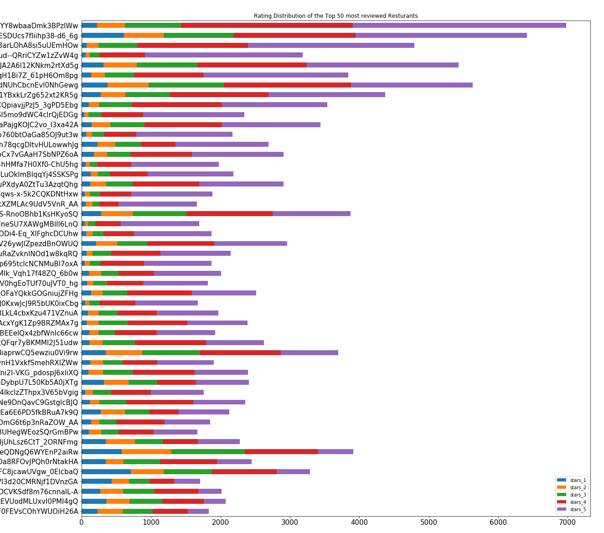
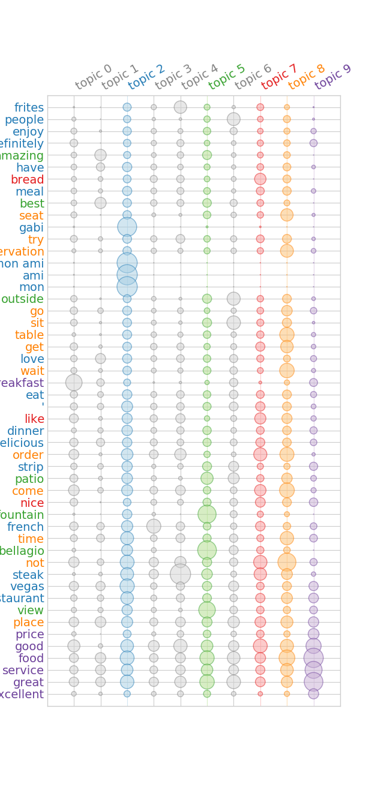

# Content Analysis and Classification of Yelp Reviews using Machine Learning

## Motivation

*Why is Natural Langauage Processing important?*  
Approximately 80% of "business-relevant information originates in unstructured form, primarily text" ([breakthroughanalysis.com](https://breakthroughanalysis.com/2008/08/01/unstructured-data-and-the-80-percent-rule/)). Obviously, if some company wants to utilize all this information, then they must be able to take this unstructured free text and turn it into something meaningful and actionable. Natural language processing (NLP) attempts to do exactly this!  
Social media is a burgeoning field built on the premise of human-to-human interaction (mainly through free text) on the internet. In this field, the ability to wrangle unstructured data can provide key insights about specific users or businesses. These insights can be used to optimize marketing campaigns to target to specific users interests, build recommender systems or improve the user experience.

## Overview
This project is built around 3 main questions and explores the power of natural language processing to process and analyze text.
#### Question 1:
Can I create build a scaleable and reusable natural language processing pipeline?
#### Question 2:
Can I find latent topics/keywords for business on Yelp based solely on user reviews of that business?
#### Question 3:
Can I use machine learning to create models to predict rating, usefulness and sentiment of a yelp review?

## The Data:

[Yelp's Challenge Dataset](https://www.yelp.com/dataset/challenge) provides access to millions of user reviews. I was able to isolate over ~3 M reviews of over 51,000 businesses containing the category keyword restaurant.

#### Feature Engineering
- **usefulness**: distinguish between useful and very-useful was somewhat arbitrary. I was trying to find ranges that would create more balanced classes.

|not_useful|useful|very_useful|
|:----------:|:------:|:--------:|
| useful = 0 |  0 < useful < 5 | useful >= 5|

- **sentiment**: grouping star rankings into more broad classes

|negative|neutral|positive|
|:----------:|:------:|:--------:|
| starsrev < 3 |  starsrev = 3 | starsrev > 3|

- **RestaurantsPriceRange2**: price rating of a restaurant (1-4) commonly seen as ($, $$, $$$, $$$$)

## Part 1:
### EDA:
This is a distribution of the average rating of all business compared to the average rating of restaurants in the Yelp business dataset. As you can see, restaurants are rated on average only slightly higher than the global business average rating.
  
Below is a distribution of rating of individual reviews for the 50 most rated restaurants in the Yelp reviews dataset. You can see a majority of reviews are rated 4 and 5 stars. This is consistent with the findings above: the average restaurant rating is ~3.7.

### Building NLP Pipeline:
[Yelp reviews were processed](https://github.com/maxgrossenbacher/nlp_yelp_reviews/blob/master/latent_topic_analysis.py) using the library Textacy. Textacy allows for mutli-processing of documents using SpaCy. During text processing, stop words are removed, words are tokenized and lemmatized, and a vocabulary of terms is generated.

## Part 2:
### Latent Topic Analysis of Reviews:
Once NLP data has been processed, NlpTopicAnalysis allows latent topic modeling using NMF, LDA (Latent Dirichlet Allocation) or LSA. For my purposes, I chose to model the yelp reviews using LDA. When modeling using LDA, best results are achieved using the term-frequency (TF) matrix of a corpus of documents. Below is a example termite plot of latent topics.  
  

* The bigger the circle, the more important the term is to the topic. The colored topics show the 5 most important topics  
Additionally, NlpTopicAnalysis can create a interactive [pyLDAvis plot](pyLDAvis_most_reviewed.html) of these latent topics.  
  

We can see that topic 6* infers that this restaurant has a view of Bellagio Fountain in Las Vegas, Nevada.  
 * This corresponds to topic 5 in the termite plot above.

## Part 3:
### Classifying Reviews Using Machine learning:
#### Baseline:
[Multinomal Naive Bayes](http://scikit-learn.org/stable/modules/generated/sklearn.naive_bayes.MultinomialNB.html#sklearn.naive_bayes.MultinomialNB) is the standard Baseline model for Bag-of-words classification of text. [Weighted F1 Score](http://scikit-learn.org/stable/modules/generated/sklearn.metrics.f1_score.html) was used to account for possible imbalance in classes.  

| Target/Label | Parameters | Mean Train Score | Mean Test Score |
|:------------:|:----------:|:----------------:|:---------------:|
| usefulness | alpha = 1 | 0.445 | 0.445 |
| sentiment | alpha = 1 | 0.547 | 0.542 |
| rating | alpha = 1 | 0.354 | 0.342 |
| price | alpha = 1 | 0.592 | 0.586 |
| target* | alpha = 1 | 0.211 | 0.196 |  

* Target is a combination of rating and price range

These models will be used as a baseline to which future models will be compared.
#### Grid Search:
A [grid search](https://github.com/maxgrossenbacher/nlp_yelp_reviews/blob/master/grid_search.py) for each target/label was run on 3 different classification models:  
* [Gradient Boosted Classifier](http://scikit-learn.org/stable/modules/generated/sklearn.ensemble.GradientBoostingClassifier.html)
* [Random Forest Classifier](http://scikit-learn.org/stable/modules/generated/sklearn.ensemble.RandomForestClassifier.html)
* [Support Vector Machine -- SVC](http://scikit-learn.org/stable/modules/generated/sklearn.svm.SVC.html#sklearn.svm.SVC)

#### Grid Search Best Models & Parameters
Models were trained on 10,000 TF-IDF vectors generated from random user reviews with a 4-Fold cross validation. Once again, the weighted F1 score was used to account for possible imbalance in class.  

| Target/Label | Model | Parameters | Mean Train Score | Mean Test Score |  
|:------------:|:-----:|:----------:|:----------------:|:---------------:|
| usefulness | Random Forest | max_features: sqrt; n_estimators: 1000 | 0.991 | 0.579 |  
| sentiment | Gradient Boosted Trees | learning_rate: 0.1; max_features: sqrt; n_estimators: 500 | 0.823 | 0.676 |  
| rating | Gradient Boosted Trees | learning_rate: 0.1; max_features: sqrt; n_estimators: 500 | 0.773 | 0.439 |  
| price | Random Forest | max_features: sqrt; n_estimators: 500 | 0.987 | 0.651 |  
| target | SVC | C: 10; kernel: linear; shrinking: True | 0.329 | 0.283 |  

 * Full Grid Search CVs can be found in grid_cvs 

#### Final Models:
Balancing classes: based on EDA of the yelp reviews dataset, it is clear that some classes are imbalanced. For instance, there are more reviews rated 4 and 5 than there are reviews rated 3, 2 or 1. In order to account for this imbalance. Previously, I used a weighted f1 score to account for this class imbalance. However for the final models, I randomly sampled from the dataset making sure that there was an equal distribution of reviews in each class.  

| Target/Label | Model | Parameters | Accuracy | F1 score |  
|:------------:|:-----:|:----------:|:--------:|:--------:|
| usefulness | Random Forest | max_features: sqrt; n_estimators: 1000 | **% | **% |  
| sentiment | Gradient Boosted Trees | learning_rate: 0.1; max_features: sqrt; n_estimators: 500 | **% | **% |  
| rating | Gradient Boosted Trees | learning_rate: 0.1; max_features: sqrt; n_estimators: 500 | **% | **% |  

Bag-of-words models v.s. Word2vec models

### Seq2Seq:

## Web App:
[Yelp Review Scorer]() will process a Yelp-type review and output a sentiment, rating and usefulness score. Scores are predicted using the final models and parameters obtained after a grid search. Have fun!

## Conclusion & Future Directions:
